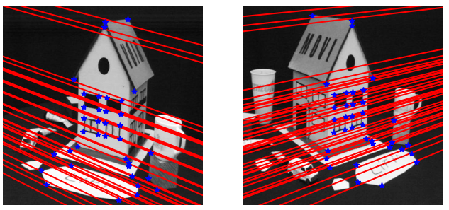
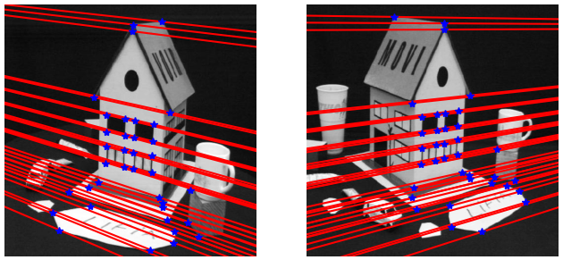
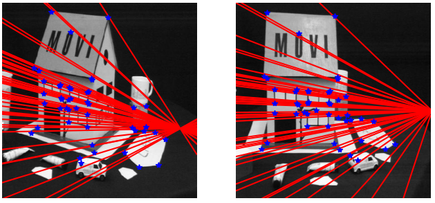
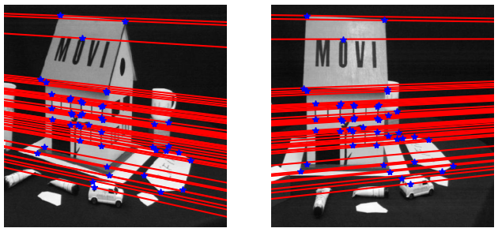

# Fumdamental Matrix Computation from Point Correspondences

Estimating Fundamental Matrix from point-correspondence between two images is a key component to solving multi-view geometry problems. In multi-view geometry, point-projections in each camera plane are related by this 3x3 matrix - projection of a 3D point in one camera plane corresponds to a line (epipolar line) in other camera planes. It allows us to triangulate 3D points using multiple-views and subsequently determine the 3D geometry.

One of the very well-known algorithms to compute fundamental matrix is called the 8-point algorithm. As the name suggests, it requires at least 8-point correspondences between images and uses linear least-squares to solve for the fundamental matrix using SVD. Since the points are in pixel-space, the magnitude of some elements in linear equation formulation [ Ax = 0 ] tends to be much higher than the others resulting in an average error between pixel and epipolar line is of order ~10px. This issue, however, can be resolved using a variant of the algorithm - normalized 8-point algorithm. This algorithm normalizes the points such that they are centered at the centroid with a mean-squared distance of 2 pixels.

Epipolar Lines for the Fundamental Matrix computed using 8-point algorithm (Set 1)  |  Epipolar Lines for the Fundamental Matrix computed using normalized 8-point algorithm (set 1)
:----------------------------:|:-------------------------:
  |  

Epipolar Lines for the Fundamental Matrix computed using 8-point algorithm (Set 2)  |  Epipolar Lines for the Fundamental Matrix computed using normalized 8-point algorithm (set 2)
:----------------------------:|:-------------------------:
  |  